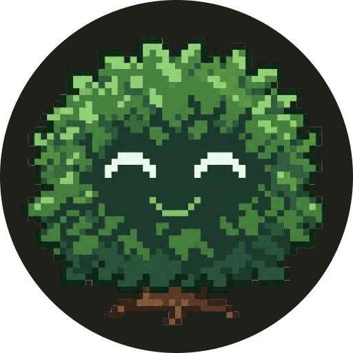
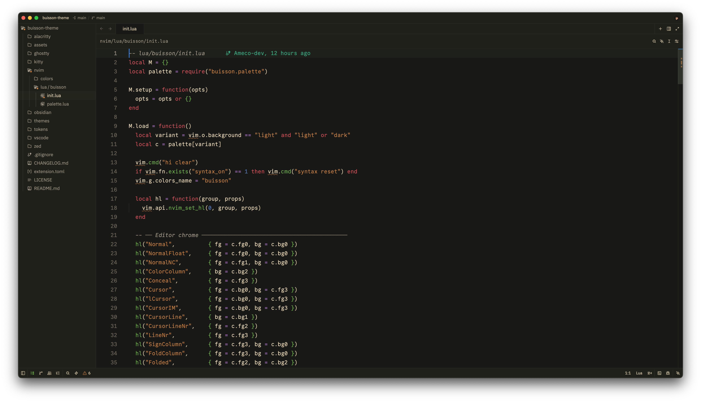
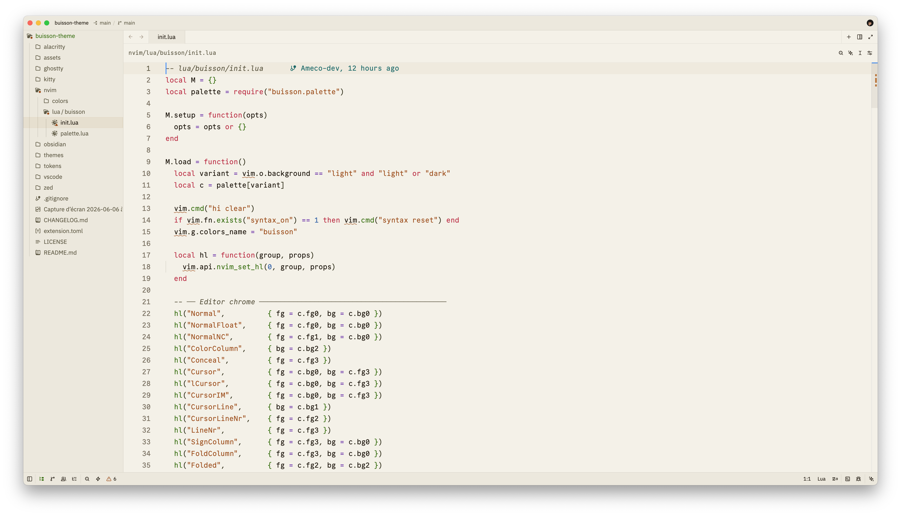
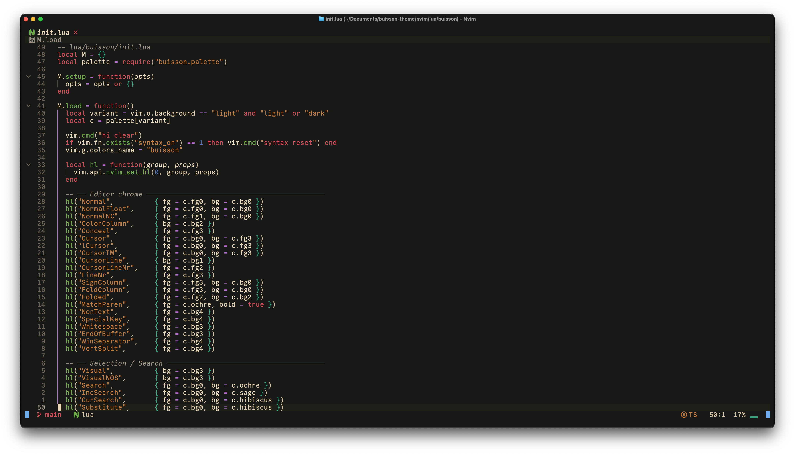
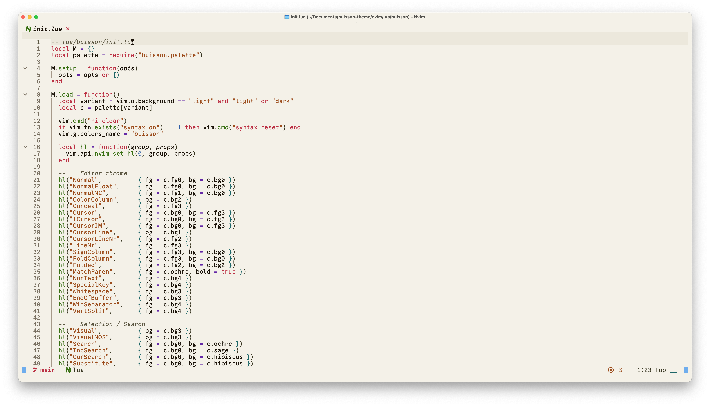
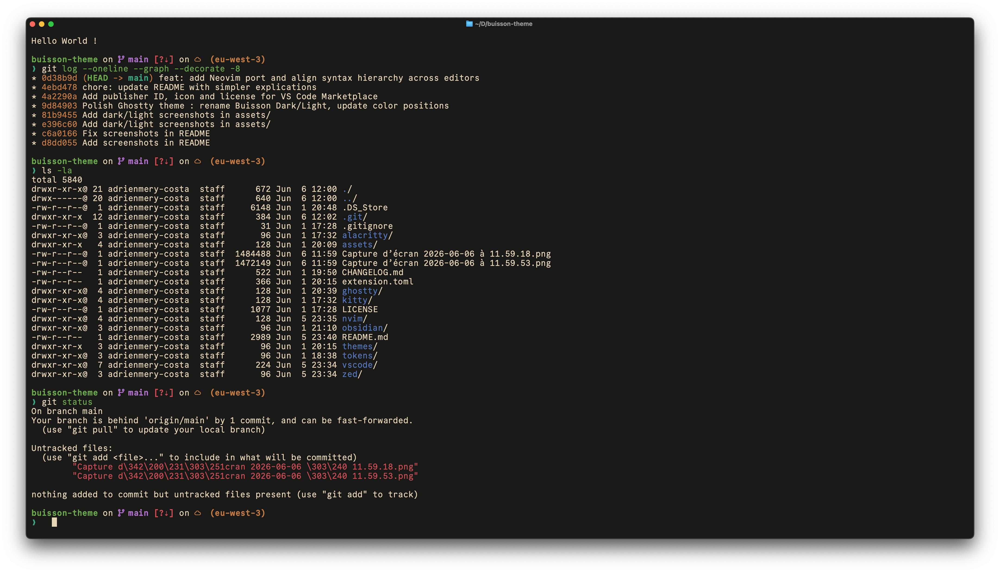
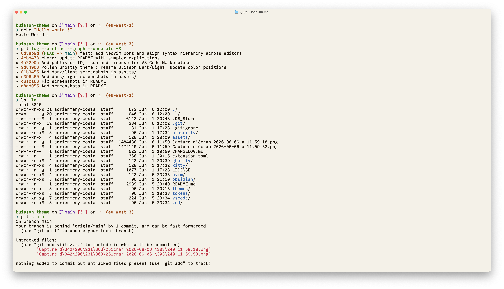
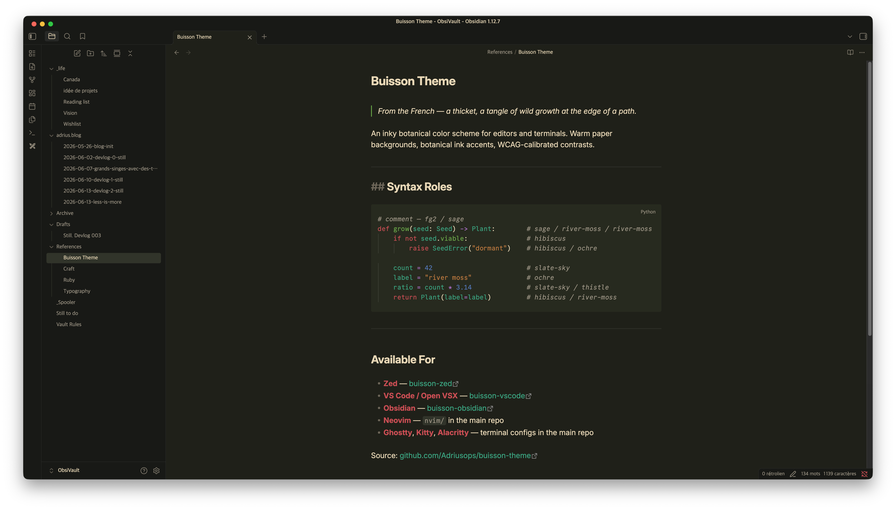
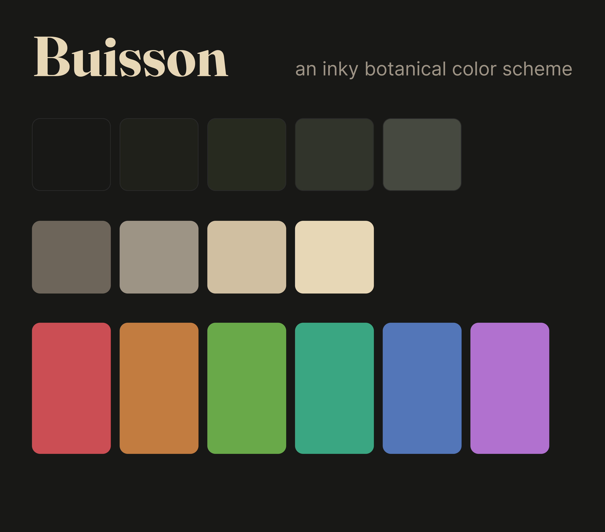
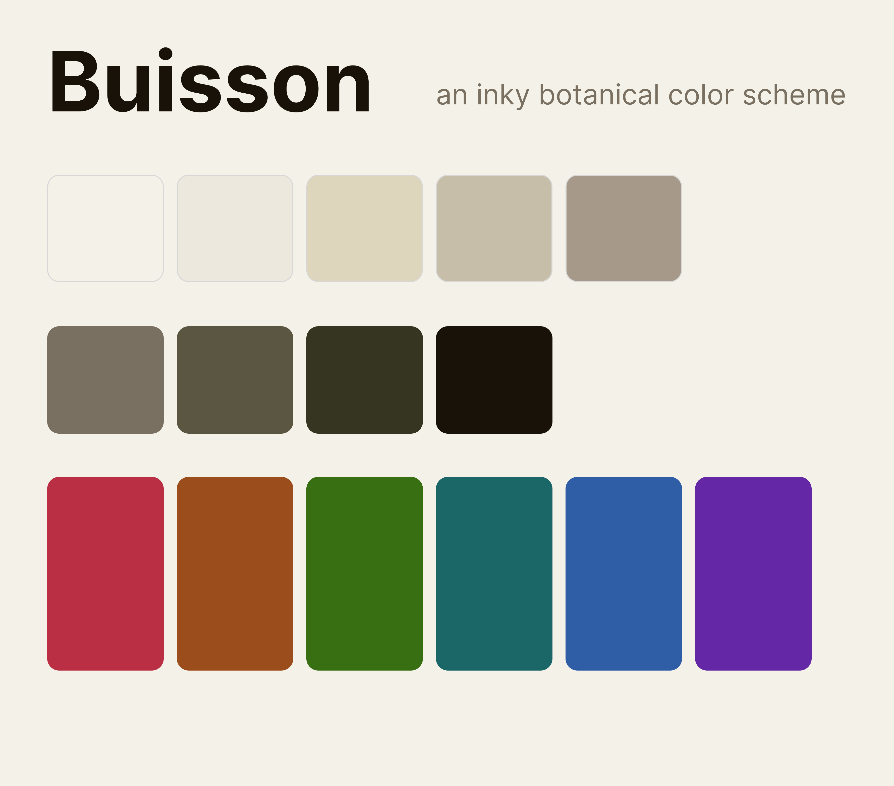

<p align="center">
  
</p>

<h3 align="center">Buisson</h3>

<p align="center"><em>Damp moss, warm parchment, and the kind of light that makes you want to stay.</em></p>

<p align="center">
  <a href="#previews">Previews</a> ·
  <a href="#installation">Installation</a> ·
  <a href="#palette">Palette</a> ·
  <a href="#ports">Ports</a>
</p>

<p align="center">
  An inky botanical color scheme for editors and terminals.<br/>
  Warm paper backgrounds, botanical ink accents, WCAG-calibrated contrasts.
</p>

<p align="center">
  
  
</p>

---

## Design

Buisson draws from [Everforest](https://github.com/sainnhe/everforest)'s warmth and [Flexoki](https://github.com/kepano/flexoki)'s accessibility discipline.

- **Botanical**: six accent colors named after plants and landscapes, each with a semantic role
- **Calibrated**: primary text AAA (11.55:1 dark / 15.15:1 light), all accents WCAG AA or above
- **Warm**: paper backgrounds with a depth hierarchy; no cold grays

## Previews

<details>
<summary>Neovim</summary>

<table>
  <tr>
    <td></td>
    <td></td>
  </tr>
</table>

</details>

<details>
<summary>Ghostty</summary>

<table>
  <tr>
    <td></td>
    <td></td>
  </tr>
</table>

</details>

<details>
<summary>Obsidian</summary>

<table>
  <tr>
    <td></td>
  </tr>
</table>

</details>

## Installation

<details>
<summary>Zed</summary>

Search for **Buisson** in Zed's extension marketplace: `zed: extensions` → search "Buisson".

See [buisson-theme/buisson-zed](https://github.com/buisson-theme/buisson-zed) for details.

</details>

<details>
<summary>VS Code</summary>

Install from the [VS Code Marketplace](https://marketplace.visualstudio.com/items?itemName=adrius.buisson-theme).

See [buisson-theme/buisson-vscode](https://github.com/buisson-theme/buisson-vscode) for details.

</details>

<details>
<summary>Obsidian</summary>

Open Obsidian → **Settings → Appearance → Themes → Manage** → search "Buisson" → Install and use.

See [buisson-theme/buisson-obsidian](https://github.com/buisson-theme/buisson-obsidian) for details.

</details>

<details>
<summary>Kitty</summary>

```sh
cp kitty/buisson-dark.conf ~/.config/kitty/
echo "include ~/.config/kitty/buisson-dark.conf" >> ~/.config/kitty/kitty.conf
```

Switch variants by changing the `include` line to `buisson-light.conf`.

</details>

<details>
<summary>Ghostty</summary>

```sh
cp "ghostty/Buisson Dark" ~/.config/ghostty/themes/
cp "ghostty/Buisson Light" ~/.config/ghostty/themes/
```

In `ghostty.conf`: `theme = dark:Buisson Dark,light:Buisson Light`

</details>

<details>
<summary>Alacritty</summary>

```sh
cp alacritty/buisson-dark.toml ~/.config/alacritty/
```

In `alacritty.toml`: `import = ["~/.config/alacritty/buisson-dark.toml"]`

</details>

<details>
<summary>Neovim</summary>

See [buisson-theme/buisson.nvim](https://github.com/buisson-theme/buisson.nvim) for installation instructions.

</details>

## Palette

| Name | Dark | Light | Role |
|------|------|-------|------|
| Hibiscus | `#d04550` | `#c02040` | keywords · booleans · exceptions |
| Sage | `#6aaa44` | `#387008` | functions · methods |
| River Moss | `#2ea882` | `#096868` | types · classes |
| Slate Sky | `#4878ba` | `#1860a8` | numbers · constants |
| Thistle | `#b070d0` | `#6028a8` | operators · decorators |
| Ochre | `#c87838` | `#a04810` | strings · templates |

<table>
  <tr>
    <td></td>
    <td></td>
  </tr>
</table>

Design tokens available in `tokens/buisson-tokens.json`, compatible with [Tokens Studio](https://tokens.studio/) and [Style Dictionary](https://amzn.github.io/style-dictionary/).

## Ports

| Platform | Status |
|----------|--------|
| Zed | ✅ marketplace |
| VS Code | ✅ marketplace |
| Obsidian | ✅ community themes |
| Kitty | ✅ |
| Ghostty | ✅ |
| Alacritty | ✅ |
| Neovim | ✅ |
| iTerm2 | 🚧 planned |

New ports are always welcome — open a PR.

## License

MIT
